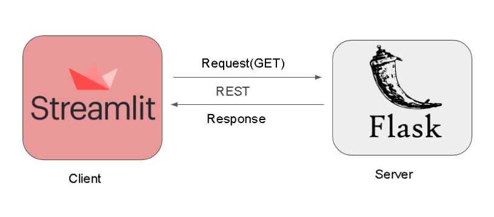

# Car-Price-Prediction 

###  End to end Machine Learning Project 


 
## Table of content

- [Project Overview ](#Project-Overview )
- [Output](#Output)
- [DataSet](#DataSet) 
- [Algothrim](#Algothrim)
- [Built With](#built-with)
- [Contributing](#contributing)
- [License](#license)
- [Get Help](#get-help)
- [Contact](#contact)


## Project Overview

In this project, I have developed a web application that can Predict the Selling Price of a Car. The Machine Learning Model is developed, trained, and deployed(as a REST API ) on Heroku Cloud using Flask. I have used Streamlit UI to develop the Frontend of the web app. The frontend makes a GET request to the server which in turn returns the predicted car price in Lakhs. 



## Output


## Live API 

### Link : https://carppp.herokuapp.com/getcp 

### Input arguments 

Present_Price  : The current showroom price of new model 

Kms_Driven  :  Number of Kelo Meters Driven with the car 

Owner : 0 -> First Hand, 1 -> Seseond Hand, 2 -> third Hand 

Year : Year of purchase of car 

Fuel_Type_Diesel : 1 if the fule type is Diesel or 0 

Fuel_Type_Petrol : 1 if the fule type is Petrol or 0 

Seller_Type_Individual : 1 if the seller type is an individual or 0 is the seller type is a dealer 

Transmission_Mannual : 1 if the Transmission type is Manual or 0 is the Transmission type is Automatic

### example input 

#### 1.Using Python Requests  

```
  import json
  import requests
  
  PARAMS = {
      "Present_Price":  5 , 
      "Kms_Driven" :  1000 ,
      "Owner" : 1  ,
      "Year" : 2015,
      "Fuel_Type_Diesel" :  1  ,
      "Fuel_Type_Petrol" :   0  ,
      "Seller_Type_Individual" :  1 ,
      "Transmission_Mannual" :  1 
  }


	# sending get request and saving the response as response object
	r = requests.get(url = URL, json = PARAMS)  
	  
	# Get the status code 
  SC = r.status_code 
	print(SC)
  
  # extracting data in json format
	data = r.json()
  print(data)
  
```

#### 2. API call using Postman 


#### Dataset

Dataset used for the treaninf and testing : [vehicle dataset from cardekho.com](https://www.kaggle.com/nehalbirla/vehicle-dataset-from-cardekho)

The dataset contains information about used cars listed on www.cardekho.com

The dataset size is 1.35 MBs.

The dataset contains 302 data points 

The columns in the given dataset is as follows:
```
Car_Name
Year
Selling_Price
Present_Price
Kms_Driven
Fuel_Type
Seller_Type
Transmission
Owner
```
Here the indipedent variable is Selling_Price 

### The corrilation between features can be expressed as:


#### Algorithm : Random Forest Regression


Random forest is a supervised learning algorithm. The "forest" it builds, is an ensemble of decision trees, usually trained with the “bagging” method. The general idea of the bagging method is that a combination of learning models increases the overall result.

Put simply: random forest builds multiple decision trees and merges them together to get a more accurate and stable prediction.

One big advantage of random forest is that it can be used for both classification and regression problems, which form the majority of current machine learning systems.  Below you can see how a random forest would look like with two trees for classification problem:


Random forest has nearly the same hyperparameters as a decision tree or a bagging classifier. Fortunately, there's no need to combine a decision tree with a bagging classifier because you can easily use the classifier-class of random forest. Random forest adds additional randomness to the model, while growing the trees. Instead of searching for the most important feature while splitting a node, it searches for the best feature among a random subset of features. This results in a wide diversity that generally results in a better model.

Therefore, in random forest, only a random subset of the features is taken into consideration by the algorithm for splitting a node. You can even make trees more random by additionally using random thresholds for each feature rather than searching for the best possible thresholds (like a normal decision tree does).

[reference](https://builtin.com/data-science/random-forest-algorithm) 

## Built With

Python

Sklearn

Pandas

Streamlit UI


## Contributing

#### Issues
In the case of a bug report, bugfix or suggestions, please feel free to open an issue.

#### Pull request
Pull requests are always welcome, and I will do my best to do reviews as fast as we can.


## License

This project is licensed under the [Apache License](https://github.com/Vivek1258/End-to-end-Machine-Learning-Project-Car-Price-Prediction/LICENSE)

## Get Help

- If appropriate, [open an issue](https://github.com/Vivek1258/End-to-end-Machine-Learning-Project-Car-Price-Prediction/issues) on GitHub

## Contact 

- Contact me on [LinkedIn](https://www.linkedin.com/in/vivek-mankar-182735184/) 
- Email mankarvivek172000@gmail.com
 


