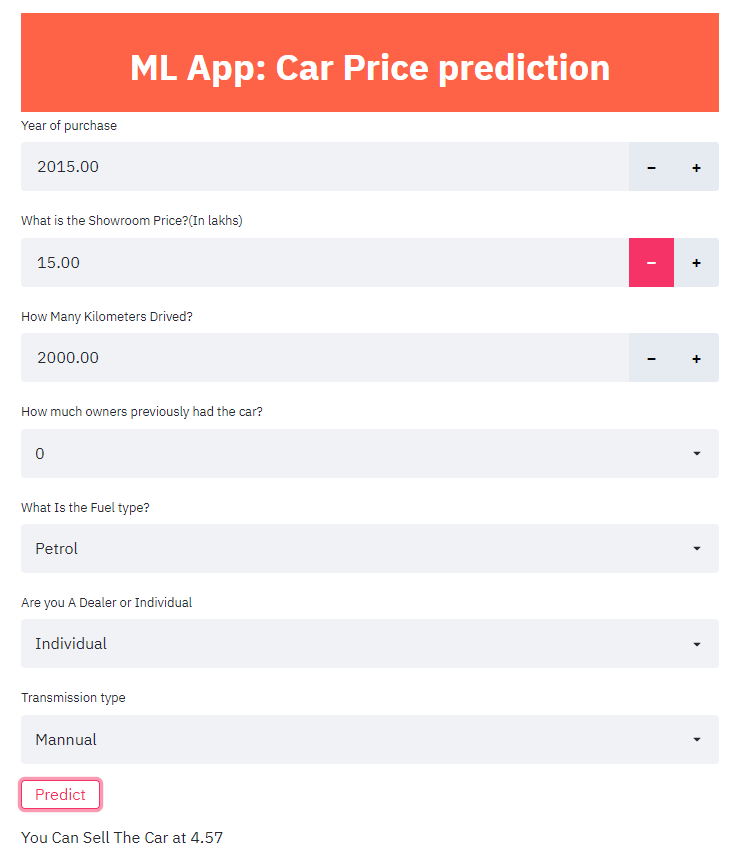

# Car-Price-Prediction

##### live app : https://carpricep.herokuapp.com/

#### Dataset: [vehicle dataset from cardekho.com](https://www.kaggle.com/nehalbirla/vehicle-dataset-from-cardekho)

#### Algorithm : random_forest_regression

## setup
```
git clone https://github.com/Vivek1258/Car-Price-Prediction-using-random_forest_regression.git

cd Car-Price-Prediction-using-random_forest_regression

pip install -r requitements.txt

streamlit run app.py
```

## 

